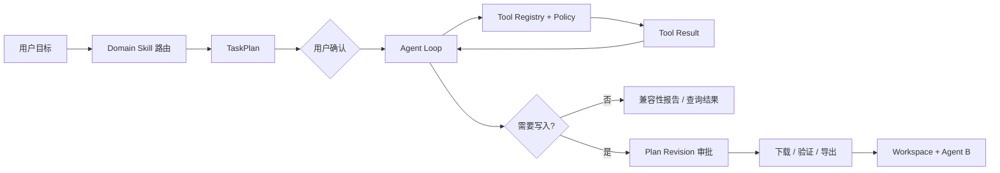

# XL-Agent · 迅雷 AI Task Agent

[](https://github.com/yogurt-stack/XL-Agent/actions/workflows/ci.yml)

一个面向本地开发环境与开源项目资源的安全型桌面 Agent。

用户只需要描述目标，XL-Agent 就可以完成任务路由、环境检查、项目分析、TaskPlan 规划、工具调用、资源审批、受控下载和工作区交接。所有网络、文件和持久化操作都由 Electron Main 统一执行，模型不能绕过权限策略直接操作主机。

> 当前版本是 Windows x64 方向的可运行 MVP。它负责分析和准备资源，不会自动安装依赖、运行仓库代码或执行任意终端命令。

## 项目简介

XL-Agent 关注的不是“帮用户找一个下载链接”，而是把一个自然语言目标转化为可确认、可执行、可审计的任务：

```text
用户目标
  → Domain Skill 路由与澄清
  → TaskPlan 生成与确认
  → Agent Loop 调用只读工具收集证据
  → 生成资源计划或兼容性报告
  → 写入操作单独审批
  → 下载、验证、Manifest 与工作区交接
```

典型任务包括：

- “检查本机 Node.js、Python、CUDA 和 CMake 环境。”

- “我想使用 PyTorch，分析当前环境还缺少什么。”

- “找到 GitHub 上的 `xxx项目`，分析它的运行要求，不要下载。”

- “把固定 commit 的项目源码准备到指定工作区。”

- “导入这个本地 Git 仓库，对比项目依赖与本机环境。”

  

   项目内置了 10 个 Skill（createDefaultDomainSkillRegistry()）：

   1. local-environment-compatibility-assessment（本地环境兼容性评估）
   2. local-project-environment-compatibility（本地项目兼容性分析）
   3. github-project-environment-compatibility（GitHub 项目兼容性分析）
   4. local-development-environment-inspection（本地开发环境只读盘点）
   5. github-project-discovery（GitHub 开源项目检索）
   6. research-data-environment（科研数据环境）
   7. ai-development-environment（AI 开发环境）
   8. web-research（通用网页搜索与研究）
   9. local-repository-structure-analysis（本地仓库结构分析）
   10. github-repository-structure-analysis（GitHub 仓库结构分析）

## 主要功能

| 能力 | 说明 |
| --- | --- |
| 任务规划 | 首轮生成 TaskPlan，展示目标、步骤、工具、风险和交付物，经用户确认后执行 |
| Agent Loop | 支持模型调用工具、读取结果并继续推理；循环受步数、时间、工具和风险预算约束 |
| 本地环境分析 | 只读检查 Node.js、npm、Python、pip、Git、CMake、CUDA、NVIDIA、Qt、OCCT 等环境 |
| 项目兼容性评估 | 读取本地仓库或 GitHub 固定 commit 的 README、清单和锁文件，并与本机环境对比 |
| GitHub 工作流 | 搜索公开仓库、固定 commit、只读分析、审批后下载源码，以及独立审批后的新仓库发布 |
| 可信资源编排 | 基于可信目录执行 HTTPS 来源、大小、SHA256、许可证和 Windows 签名校验 |
| 受控下载 | 流式写盘、进度与 ETA、暂停、恢复、取消和 HTTP Range 断点续传 |
| 工作区交接 | 生成资源 Manifest、说明文件、验证脚本和来源归档，并由只读 Agent B 复查 |
| 持久化与审计 | 使用 SQLite 保存任务、计划 revision、审批、下载、工作区、历史和操作事件 |

## 快速开始

### 环境要求

- Node.js 22
- npm
- macOS、Linux 或 Windows 开发环境
- Windows x64 用于最终安装包和 Windows 资源验证

### 从源码启动

```bash
git clone https://github.com/yogurt-stack/XL-Agent.git
cd XL-Agent
npm install
npm run dev
```

应用默认使用本地规则模型，因此无需 API Key 也可以运行演示流程。

### 配置远程模型（可选）

复制 `.env.example` 为 `.env`，配置一个支持 OpenAI Chat Completions `tools/tool_calls` 的 HTTPS 端点：

```dotenv
XL_AGENT_LLM_PROVIDER=openai-compatible

# 以下两项只配置一个
XL_AGENT_LLM_ENDPOINT=https://your-model-host.example/v1/chat/completions
# XL_AGENT_LLM_BASE_URL=https://your-model-host.example/v1

XL_AGENT_LLM_MODEL=your-model-id
XL_AGENT_LLM_API_KEY=your-secret
```

当前适配 OpenAI-compatible 服务和 DeepSeek。配置变更后需要重新运行 `npm run dev`。远程调用失败时，Runtime 会熔断当前远程连接并回退到本地规则模型。

### 配置 GitHub（可选）

公开仓库搜索无需 Token。更高查询额度和仓库发布分别使用不同凭证：

```dotenv
# 只读查询额度
XL_AGENT_GITHUB_TOKEN=your-read-token

# 仅用于审批后的 GitHub 发布
XL_AGENT_GITHUB_PUBLISH_TOKEN=your-write-token
```

只读 Token 不会被用作发布凭证，密钥只保存在 Electron Main 进程中。

## Core Agent Loop

### 通用网页搜索与研究

输入“帮我找支持 Windows、离线运行和中文的开源知识库项目”，Agent 会进入网页研究：保留完整需求，搜索候选、读取官网或文档、按结果改写查询，再生成带引用的结论。直接提供 `owner/repo` 或 GitHub 仓库 URL 仍可进入原有仓库流程；输入“使用 GitHub API，查找 tau 项目”可以显式选择原有 API 检索。

在 `.env` 中选择一个搜索服务，修改后重启应用：

```dotenv
XL_AGENT_SEARCH_PROVIDER=tavily
XL_AGENT_TAVILY_API_KEY=your-search-key
```

Tavily 使用 Search 查找来源、Extract 提取正文。也可选择自部署 SearXNG：

```dotenv
XL_AGENT_SEARCH_PROVIDER=searxng
XL_AGENT_SEARXNG_URL=http://127.0.0.1:8080
```

SearXNG 必须在自己的 `settings.yml` 中启用 `search.formats: [html, json]`。该模式由 Electron Main 抓取公开 HTML/纯文本，并使用 Readability 提取正文，不运行网页脚本。显式配置的 SearXNG 服务可以位于本机；网页读取拒绝本机、内网与非公网解析，并逐跳验证重定向、固定 DNS 解析结果。

完整的查询改写和资料综合需要可用的远程模型（配置见上文）。规则降级模式只搜索并读取最多三页，不生成未经推理的推荐；结果明确标注“部分完成”。服务未配置或所有请求失败时展示“暂不可用”与原因。无搜索密钥时仍可使用 GitHub 精确仓库定位。

每个研究任务最多五次搜索、十次正文读取、十八轮模型调用、四分钟执行时间；正文最多 24,000 字符，超限标明截断。网页报告区分搜索摘要与已读正文，拒绝引用未读网页作为已验证结论。页面内容始终作为不可信资料处理。登录页面、动态渲染页面、PDF 和反爬站点不保证可读。

网页结果中识别出的 GitHub 仓库可以继续选择“分析仓库”或“准备到本地”。宿主重新核实仓库并固定 commit；下载继续需要独立审批。API 搜索保留未识别许可证、归档和 Fork 仓库作为候选，下载时仍执行原有许可证和来源校验。普通发现不再默认限制新建时间。

XL-Agent 使用 Plan-and-Solve 与受控 ReAct 循环结合的运行方式：先确认计划，再在明确的能力边界内执行“模型 → 工具 → 观察结果 → 下一步”。



核心约束：

- 第一阶段 Agent Loop 只允许调用当前 Domain Skill 授权的只读工具。
- 工具名、输入参数和返回值使用 Zod 严格校验，未知工具和额外字段会被拒绝。
- 下载、导出和 GitHub 发布等写入操作必须进入新的计划 revision，并由用户单独审批。
- Runtime 设置最大轮次、最大工具调用数、重复调用限制和超时，避免模型无限循环。
- Renderer 只展示状态和发送白名单事件；模型、Policy、工具、SQLite 和文件操作都运行在 Electron Main。

主要实现位于：

- `src/features/agent-core/agentLoop.ts`：可复用 Agent Loop Kernel
- `src/features/agent-core/runtime.ts`：TaskPlan、状态机和 Agent Loop 编排
- `src/features/agent-core/taskPlanExecutor.ts`：Plan-and-Solve 步骤驱动器
- `src/features/agent-core/agentServices.ts`：工具注册、执行和 Policy 边界
- `electron/agentRuntimeHost.ts`：Electron Main Orchestrator

## 实际使用流程

### 1. 只读环境检查

输入“查询本地 Node.js、npm、Python 和 CUDA 版本”。Agent 会调用环境检查工具并直接生成报告，不创建下载计划。

### 2. GitHub 项目分析

输入项目名称或仓库地址，选择搜索结果后执行环境分析。Agent 会固定默认分支 commit，只读检查项目清单和 README，再与本机环境对比；只有用户选择“准备到本地”后才会进入下载审批。

### 3. 本地仓库分析

通过首页选择本地 Git 仓库。Main 只读取 HEAD、分支、工作区状态和白名单项目文件，不执行 Git hooks、项目脚本或依赖安装。

### 4. 资源准备与工作区交接

用户确认资源计划并选择工作区目录后，Main 执行受控下载与验证，最终生成：

```text
workspace/
  resource-manifest.json
  RESOURCE_MANIFEST.md
  README.md
  AGENTS.md
  sources/
  dependencies/
  scripts/
```

“接入本地文件或目录”是添加输入资源；“选择工作区目录”是选择最终交付物的输出位置。

## 技术栈

| 层级 | 技术 |
| --- | --- |
| 桌面端 | Electron 43、Preload、白名单 IPC |
| 界面 | React 18、TypeScript、Vite 6、Lucide Icons |
| Agent Core | TypeScript、TaskPlan DAG、ReAct Agent Loop、Domain Skill Registry |
| 模型协议 | OpenAI-compatible Chat Completions、原生 Function Tool Calling |
| 协议与策略 | Zod、Tool Registry、Policy、revision 审批 |
| 持久化 | SQLite（sql.js）、Manifest snapshots |
| 测试与交付 | Vitest、Playwright、axe-core、electron-builder、GitHub Actions |

## 安全边界

- `nodeIntegration: false`，Renderer 不能直接访问 Node、文件系统、数据库或任意 IPC。
- 模型没有 Shell Tool，也不能提交任意下载 URL。
- GitHub 源码下载固定到不可变 commit SHA。
- 下载前后校验可信 Host、大小和哈希；Windows 资源可要求 Authenticode 发布者匹配。
- Agent B 只有工作区只读权限，授权绑定 task、revision、grant 和 TTL。
- GitHub 查询与发布使用相互隔离的 Token 和审批链。

## 常用命令

| 命令 | 用途 |
| --- | --- |
| `npm run dev` | 启动 Electron 开发环境 |
| `npm run build` | 类型检查并生成 production build |
| `npm run test:run` | 运行 Vitest 单元与集成测试 |
| `npm run test:e2e` | 构建并运行 Electron Playwright E2E |
| `npm run verify:ci` | 执行完整本地质量门禁 |
| `npm run package:win` | 生成 Windows x64 NSIS 和 ZIP |

## 项目结构

```text
XL-Agent/
├── catalog/                 # 可信资源目录与 Schema
├── electron/                # Main、Preload、下载、验证、SQLite 与工作区
├── src/
│   ├── features/agent-core/ # Agent Loop、TaskPlan、路由、Policy 与 Tool
│   └── components/          # React 页面与交互组件
├── e2e/                     # Electron Playwright 测试
├── scripts/                 # 构建、验证和打包脚本
└── docs/                    # 架构、阶段验收与安全边界文档
```

## 当前边界

- 当前不会自动安装依赖、运行仓库代码或执行任意终端命令。
- `LocalXunleiAdapter` 默认使用 Electron Main 的受控 HTTP 下载后端；设置 `XL_AGENT_XUNLEI_ENABLED=1`、构建原生宿主并提供迅雷凭证后，可切换到 C++ SDK 下载传输。
- GitHub 发布首版只创建新仓库，不覆盖、追加或强推，也不复制原仓库提交历史。
- Windows 安装包是未签名的内部 Demo，公开分发前仍需要代码签名与 Windows 11 实机验收。
- 项目依赖分析仍在持续改进，目前可能将示例或测试目录中的要求标记为“待确认”。

## 延伸文档

- [Agent Runtime 当前架构](docs/agent-runtime-refactor.md)
- [资源编排与工作区](docs/p0-resource-orchestration-2026-07-26.md)
- [供应链安全与恢复](docs/p1-supply-chain-resilience-2026-07-26.md)
- [本地仓库导入与 GitHub 发布](docs/local-repository-import-and-github-publish-2026-07-30.md)
- [Windows Demo 与分发](docs/p3-demo-distribution-2026-07-29.md)
